# Hey, I'm Sudhanshu 👋

Final-year CS student at VIT, into full-stack development and AI — I like building products end-to-end, then figuring out where AI can genuinely make something smarter instead of bolting it on for the sake of it.

I'm part of the team building **[FORKE](https://github.com/forke-org)** — a gamified micro-task marketplace for developers. Startups post bite-sized, fixed-budget coding tasks (30 min – 4 hr), you claim one gated to your skill tier, work in an isolated Forke-managed branch, open a PR, and get paid instantly via UPI once it's approved. Every submission runs through automated checks and an AI review pipeline before the owner even sees it — no bidding wars, no proposals, just claim, code, get paid.

Long-term, I want to work somewhere I actually believe in, ship things that matter, and look back with no regrets.

---

### Stack I reach for

`TypeScript` `Node.js` `React` `Next.js` `Python` `MySQL` `Tailwind`

### Outside of code

Cricket — Kohli paglu 🐐  
Anime — One Piece is the GOAT, no debate   
Games — still play Brawl Stars (yeah, I know, don't @ me)   

---

### Open to work / collab

Always up for interesting full-stack or AI projects — feel free to reach out.

[Portfolio](https://www.sudhanshubatra.in/) · [LinkedIn](https://www.linkedin.com/in/sudhanshu-batra/) · [Instagram](https://www.instagram.com/batra_sudhanshu/)

<table>
<tr>
<td></td>
<td></td>
</tr>
</table>

